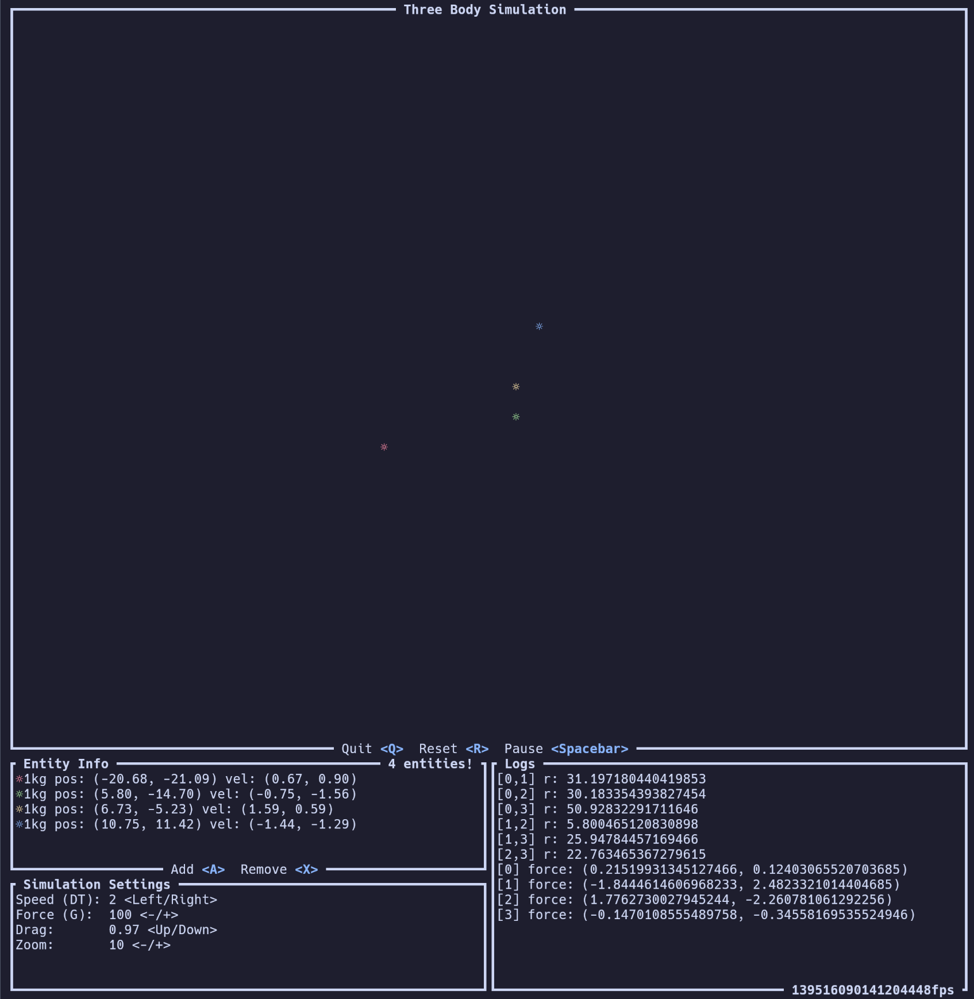

# Three Body Problem

The three body problem (the namesake of the book and Netflix series) is a problem in physics in determining the orbital path of three bodies with respect to their gravitational pulls. This simulator was built to visualise the paths of these bodies (extended to the n-body problem) albeit with some questionable accuracy (capped acceleration, damping of velocities) for more aesthetic movement. This projects main goal is to learn how to build TUIs, specifically the [ratatui](https://ratatui.rs/) framework.
